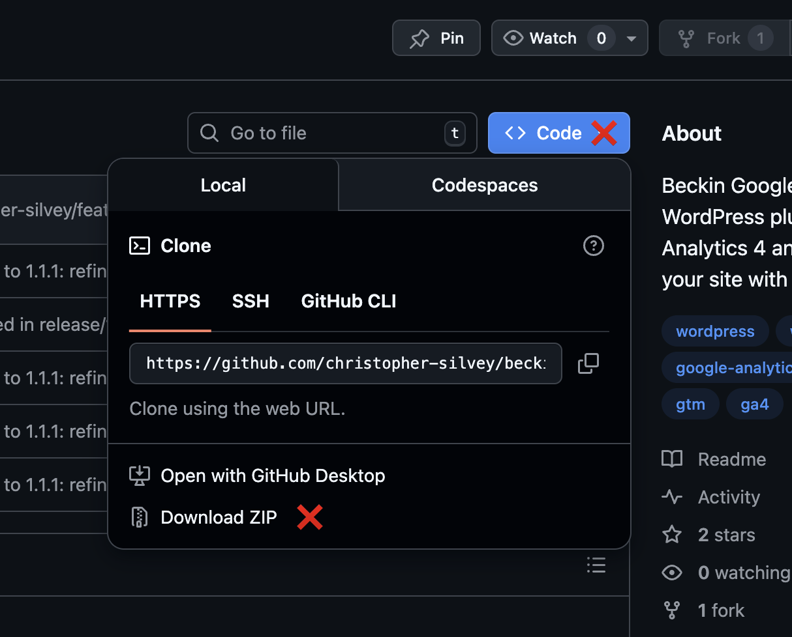
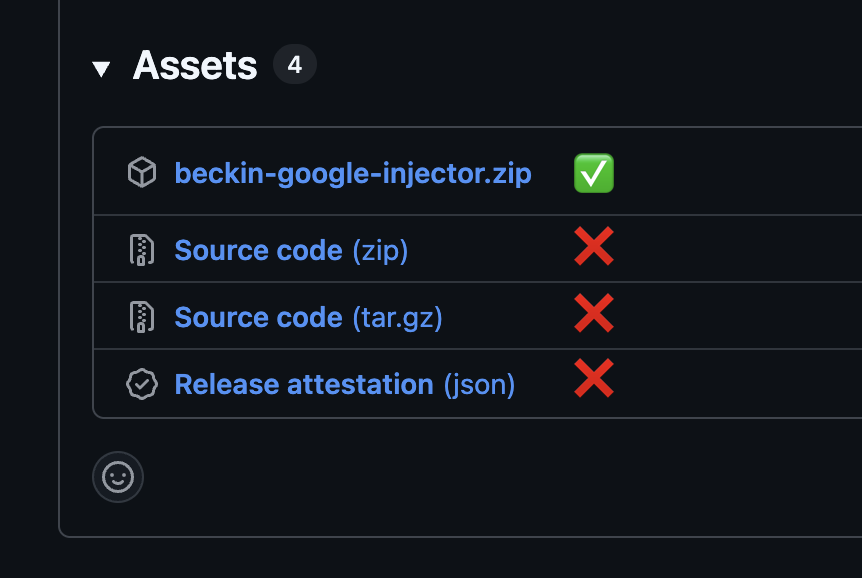

### Download

Always download the plugin from the **Releases** page, not from the "Code" button.

- Latest version:  
  [Download beckin-google-injector.zip](https://github.com/christopher-silvey/beckin-google-injector/releases/latest/download/beckin-google-injector.zip)

The auto generated "Source code" zips (`beckin-google-injector-main.zip`, etc.) are for developers and are **not** in the correct naming format for WordPress installation.

# Beckin Google Injector

Beckin Google Injector is a lightweight WordPress plugin that adds Google Analytics 4 and Google Tag Manager to your site with a simple settings screen. Enter your GA4 Measurement ID and/or your GTM Container ID, choose whether to load scripts for logged in staff, and pick header or footer placement.

### Features

- Simple settings page under **Settings → Beckin Google Injector**
- GA4 Measurement ID field with validation (must look like `G-XXXXXXXXXX`)
- GTM Container ID field with validation (must look like `GTM-XXXXXXX`)
- Supports GA4 only, GTM only, or both (for other tags through GTM)
- Option to load or skip scripts for logged in staff (administrators, editors, authors, contributors) (recommended: skip)
- Script placement control, header or footer (header is recommended for accuracy)
- Uses `wp_enqueue_script` and `wp_add_inline_script` so it plays nicely with caching and optimization plugins
- Self hosted automatic updates powered by GitHub and Plugin Update Checker
- Safety notice when both GA4 and GTM are configured, reminding you not to also fire GA4 as a GTM tag with the same Measurement ID to avoid double counting

### Requirements

- WordPress 6.8 or higher
- PHP 8.0 or higher

### Installation

> Tip: Do not use the auto generated "Source code" downloads or the downloaded zip file from the "Code" button. Always use `beckin-google-injector.zip` from Releases, not `beckin-google-injector-main.zip, etc`, so the plugin folder name properly matches the plugin slug. i.e. `beckin-google-injector.zip`

	
	

#### Automatic installation (uploading the ZIP)

1. Download the latest `beckin-google-injector.zip` from the **Releases** page (or the link above).
2. Log into your WordPress admin.
3. Click **Plugins → Add New**.
4. Click the **Upload Plugin** button at the top.
5. Click **Choose File** and select the `beckin-google-injector.zip` file.
6. Click **Install Now**.
7. When the installation completes, click **Activate Plugin**.

#### Manual installation

1. Download the latest `beckin-google-injector.zip` from the **Releases** page (or the link above).
2. Extract the contents of the zip file.
3. Upload the `beckin-google-injector` folder into your `wp-content/plugins` directory.
4. In the WordPress admin, go to **Plugins → Installed Plugins**.
5. Activate **Beckin Google Injector**.

### Configuration

1. Go to **Settings → Beckin Google Injector**.
2. (Optional) Paste your GA4 Measurement ID (for example `G-XXXXXXXXXX`) to inject GA4 directly.
3. (Optional) Paste your GTM Container ID (for example `GTM-XXXXXXX`) to inject Google Tag Manager.
4. Choose whether to load scripts for logged in staff (administrators, editors, authors, contributors).
5. Choose script placement:
   - **Header** (recommended) so GA4 and GTM load earlier.
   - **Footer** if you prefer it.
6. Save changes.

Once saved, the plugin will start loading GA4 and/or GTM on the frontend according to your settings. If you configure both GA4 and GTM, make sure you do not also fire GA4 as a tag inside GTM with the same Measurement ID, or your pageviews and events may be double counted.

### Automatic Updates

This plugin uses [Plugin Update Checker](https://github.com/YahnisElsts/plugin-update-checker) and a GitHub repository for self hosted updates.

- Repository URL: `https://github.com/christopher-silvey/beckin-google-injector`

### Support This Project

If this plugin saves you time or helps you ship cleaner analytics & tracking for clients, you can support ongoing development in a few quick ways:

- [Sponsor my work on GitHub](https://github.com/sponsors/christopher-silvey)
- [Buy me a coffee](https://buymeacoffee.com/beckin)
- ⭐ Star this repository to help others discover it
- 👀 Watch this repository to get notified about new releases and improvements

### Changelog

#### 1.1.2

- Marked the plugin as compatible with WordPress 6.9.
- Updated the installation section with a clearer tip and side-by-side screenshots showing the correct ZIP to download from Releases.
- Added a `docs/images` folder for README screenshots only (no runtime code changes).

#### 1.1.1

- Fine tuned the Plugin Update Checker configuration so it lines up cleanly with the new GitHub repository and tagged releases.
- Updated the Automatic Updates and installation documentation to make the GitHub download and install flow clearer.

#### 1.1.0

- Switched Plugin Update Checker to use the new GitHub repository instead of Bitbucket.
- Updated the Automatic Updates documentation to reference the GitHub repo for self hosted updates.

#### 1.0.6

- Removed the `.gitignore` file from the distributed plugin so hidden files are not shipped.
- Added a `languages` directory with a placeholder index file to match the plugin header `Domain Path` and satisfy Plugin Check.

#### 1.0.5

- Removed `.gitignore` from the distributed plugin so hidden files are not shipped.
- Fixed the plugin header "Domain Path" warning by ensuring the `languages` directory exists and matches the header value.
- Reduced the readme tag list to 5 tags to satisfy the WordPress readme parser and Plugin Check.

#### 1.0.4

- Ran phpcbf with the WordPress coding standard across all plugin files to normalize formatting, spacing, and docblocks.
- No functional changes in this release. This is a housekeeping update to keep the codebase aligned with WordPress coding standards.

#### 1.0.3

- Aligned GA4 and GTM markup with Google’s official install snippets by adding the standard `<!-- Google tag (gtag.js) -->` comment and wrapping the GTM loader script with `<!-- Google Tag Manager -->` comments.
- Wrapped the GTM `<noscript>` iframe with matching `<!-- Google Tag Manager (noscript) -->` comments for clarity. No functional tracking changes, just cleaner, more familiar markup.

#### 1.0.2

- Updated GTM implementation to bootstrap dataLayer and push the standard gtm.js event before the GTM script runs.
- Added a GTM noscript iframe via wp_body_open so a basic container still fires when JavaScript is disabled.
- Centralized async handling for GA4 and GTM scripts using the script_loader_tag filter so both tags consistently load with the async attribute.
- Kept GTM staff checks and options lookup aligned with the GA4 logic so behavior stays consistent and easier to maintain.

#### 1.0.1

- Updated logged in tracking logic to treat "staff" as any user who can edit posts (administrators, editors, authors, contributors) and exclude them from tracking by default.
- Renamed the setting label and help text to talk about logged in staff instead of only administrators.
- Updated README wording to reflect the staff behavior and clarify recommended settings.

### 1.0.0

- Initial release.
- Adds GA4 Measurement ID setting with validation.
- Adds GTM Container ID setting with validation.
- Header or footer placement option for GA4 and GTM scripts (header recommended).
- Toggle to load or skip script loading for logged in administrators (do not load recommended).
- GA4 loading implemented via `wp_enqueue_script` and `wp_add_inline_script`.
- GTM loading implemented via `wp_enqueue_script`.
- Self hosted automatic updates wired to the Bitbucket repository using Plugin Update Checker.
